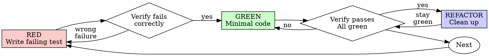

# Test-Driven Development (TDD)

这是 `/zhanggui` execution 的 supporting stage，不是独立 skill。永久生产功能、bugfix、refactor 或行为变化必须在写实现代码前读取本文件；throwaway prototype 不进入本 stage。

输入包含当前 task id、observable contract、boundary 和 validation。Red/Green/Refactor 结果返回同一 execution task，不能改变 WorkflowState 的 owner、design decisions 或全局 readiness。

## 概述

先写测试。看它失败。再写最小实现让它通过。

**核心原则：没看过测试失败，就不知道它测的是不是对的东西。**

**违反规则的字面就是违反规则的精神。**

## 适用范围

**必须走 TDD：**

- 新功能
- Bug 修复
- 重构
- 行为变化

**豁免（由编排器路由决定，不问用户）：**

- Throwaway prototype——执行循环在加载前就排除，不会路由进本 stage。
- 生成代码 / 配置文件——编排器按 task boundary 和 validation 豁免并记录 assumption；仅不可逆或高风险情形才升级给用户。

想着"就这一次跳过 TDD"？停。那是合理化。

## The Iron Law

```
NO PRODUCTION CODE WITHOUT A FAILING TEST FIRST
```

先写了实现？删掉。重来。

**没有例外：**

- 不许留作"参考"
- 不许边写测试边"改编"它
- 不许看它
- 删除就是删除

从测试出发重新实现。就这样。

## Red-Green-Refactor



### RED - 写失败测试

写一个最小测试，表达应该发生什么。

<Good>
```typescript
test('retries failed operations 3 times', async () => {
  let attempts = 0;
  const operation = () => {
    attempts++;
    if (attempts < 3) throw new Error('fail');
    return 'success';
  };

  const result = await retryOperation(operation);

  expect(result).toBe('success');
  expect(attempts).toBe(3);
});
```
名字清晰，测真实行为，只测一件事
</Good>

<Bad>
```typescript
test('retry works', async () => {
  const mock = jest.fn()
    .mockRejectedValueOnce(new Error())
    .mockRejectedValueOnce(new Error())
    .mockResolvedValueOnce('success');
  await retryOperation(mock);
  expect(mock).toHaveBeenCalledTimes(3);
});
```
名字含糊，测的是 mock 不是代码
</Bad>

**要求：**

- 一个行为
- 名字说清行为
- 真实代码（mock 仅在不可避免时用）

### Verify RED - 看它失败

**强制。绝不跳过。**

```bash
npm test path/to/test.test.ts
```

确认：

- 测试是失败（fail），不是报错（error）
- 失败信息符合预期
- 失败原因是功能缺失，不是拼写错误

**测试直接通过了？** 你在测既有行为。改测试。

**测试报错？** 修掉报错，重跑直到以正确原因失败。

### GREEN - 最小实现

写让测试通过的最简单代码。

<Good>
```typescript
async function retryOperation<T>(fn: () => Promise<T>): Promise<T> {
  for (let i = 0; i < 3; i++) {
    try {
      return await fn();
    } catch (e) {
      if (i === 2) throw e;
    }
  }
  throw new Error('unreachable');
}
```
刚好够通过
</Good>

<Bad>
```typescript
async function retryOperation<T>(
  fn: () => Promise<T>,
  options?: {
    maxRetries?: number;
    backoff?: 'linear' | 'exponential';
    onRetry?: (attempt: number) => void;
  }
): Promise<T> {
  // YAGNI
}
```
过度设计
</Bad>

不加多余功能，不顺手重构别处，不超出测试"改进"。

### Verify GREEN - 看它通过

**强制。**

```bash
npm test path/to/test.test.ts
```

确认：

- 测试通过
- 其他测试仍然通过
- 输出干净（无 error、无 warning）

**测试失败？** 改代码，不改测试。

**其他测试挂了？** 现在就修。

### REFACTOR - 清理

只在 green 之后：

- 消除重复
- 改进命名
- 提取 helper

保持全绿。不加行为。

### 重复

为下一个功能写下一个失败测试。

## 好测试的标准

| 质量 | 好 | 坏 |
|---------|------|-----|
| **最小** | 一件事。名字里出现 "and"？拆分。 | `test('validates email and domain and whitespace')` |
| **清晰** | 名字描述行为 | `test('test1')` |
| **表达意图** | 展示期望的 API | 看不出代码应该做什么 |

## Common Rationalizations（合理化识别）

| 借口 | 现实 |
|--------|---------|
| "太简单不用测" | 简单代码也会坏。测试只要 30 秒。 |
| "我之后补测试" | 事后测试立即通过，什么也证明不了。 |
| "事后测试达到同样目的" | 事后测的是"这代码做了什么？"事先测的是"这代码该做什么？"事后测试被实现带偏：你测你写出来的，不是需求要的。 |
| "我已经手动测过了" | 临时点一遍 ≠ 系统化。没记录、不能重跑、换个改动就得重来。 |
| "删掉 X 小时的工作太浪费" | 沉没成本谬误。留着没有可信测试的代码才是技术债。 |
| "留作参考，先写测试" | 你会照着改。那就是事后测试。删除就是删除。 |
| "我需要先探索" | 可以。探索完扔掉，从 TDD 重新开始。 |
| "测试难写 = 该多想想设计" | 听测试的。难测就是难用。 |
| "TDD 拖慢进度" | TDD 比事后 debug 快。捷径 = 生产环境里调试 = 更慢。 |
| "手动验证更快" | 手动证明不了边缘情况，而且每次改动都得重测。 |
| "现有代码也没测试" | 你在改进它。给现有代码补测试。 |
| "这是精神不是仪式" | 违反字面就是违反精神。 |

## Red Flags - 停下重来

- 实现在测试前
- 测试在实现后补
- 测试立即通过
- 说不出测试为什么失败
- 测试"以后再加"
- "就这一次"的合理化
- "我已经手动测过了"
- "事后测试达到同样目的"
- "这是精神不是仪式"
- "留作参考"或"改编现有代码"
- "已经花了 X 小时，删了可惜"
- "TDD 太教条，我讲究务实"
- "这次不一样，因为……"

**出现任何一条：删掉代码，从 TDD 重来。**

## 示例：Bug 修复

**Bug：** 空邮箱被接受

**RED**
```typescript
test('rejects empty email', async () => {
  const result = await submitForm({ email: '' });
  expect(result.error).toBe('Email required');
});
```

**Verify RED**
```bash
$ npm test
FAIL: expected 'Email required', got undefined
```

**GREEN**
```typescript
function submitForm(data: FormData) {
  if (!data.email?.trim()) {
    return { error: 'Email required' };
  }
  // ...
}
```

**Verify GREEN**
```bash
$ npm test
PASS
```

**REFACTOR**
多字段需要校验时提取校验逻辑。

## 完成检查单

标记工作完成前：

- [ ] 每个新函数/方法都有测试
- [ ] 每个测试都看过失败
- [ ] 每个测试以预期原因失败（功能缺失，不是拼写错误）
- [ ] 每个测试写的是最小实现
- [ ] 所有测试通过
- [ ] 输出干净（无 error、无 warning）
- [ ] 测试用真实代码（mock 仅在不可避免时用）
- [ ] 覆盖边缘情况和错误路径

有勾不上的？你跳过了 TDD。重来。

## 卡住时

| 问题 | 解法 |
|---------|----------|
| 不知道怎么测 | 先写理想中的 API 调用。先写断言。或请用户协助。 |
| 测试太复杂 | 设计太复杂。简化接口。 |
| 什么都得 mock | 代码耦合太重。用依赖注入。 |
| 测试准备太庞大 | 提取 helper。还是复杂？简化设计。 |

## 与调试的衔接

发现 bug？先写复现它的失败测试，再走 TDD 循环。测试既证明修复有效，也防止回归。

绝不在没有测试的情况下修 bug。

## Testing Anti-Patterns

添加 mock 或测试工具时，先读 [testing-anti-patterns.md](testing-anti-patterns.md) 避免常见陷阱：

- 测 mock 行为而不是真实行为
- 给生产类加 test-only 方法
- 不理解依赖就 mock

## Final Rule

```
生产代码 → 测试存在且先失败过
否则 → 不是 TDD
```

豁免只由编排器按上文的路由和 boundary 规则授予并记入 task notes——绝不静默假设，也绝不默认推给用户。
